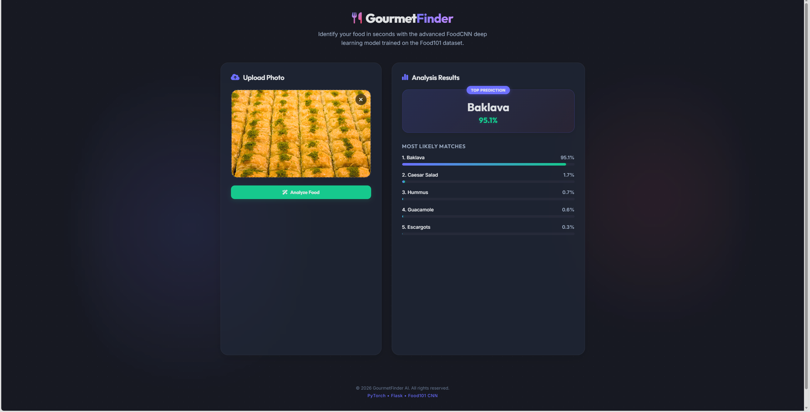
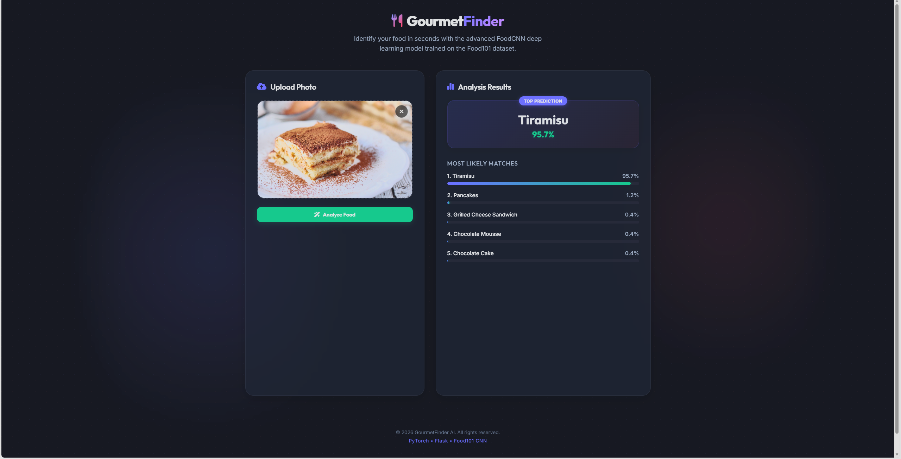
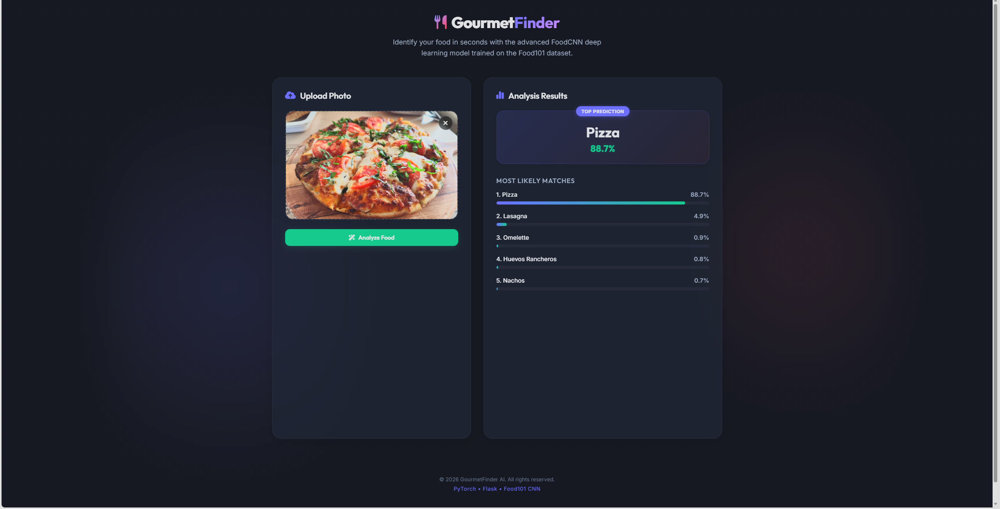

# Food101 Image Classification

A deep learning image classification project built with PyTorch using a custom Convolutional Neural Network trained from scratch on the Food-101 dataset.

## Project Overview

This project focuses on large-scale food image classification across 101 categories using a fully custom CNN architecture without transfer learning.

The training pipeline was designed to improve generalization and training stability through advanced augmentation and regularization techniques.

## Visual Results

  
  

  

## Model Architecture
Custom CNN architecture including:

- 5 convolutional blocks
- Batch Normalization after each convolution
- ReLU activations
- MaxPooling layers
- Adaptive Global Average Pooling
- Fully connected classifier with Dropout regularization

## Training Pipeline

Implemented advanced deep learning techniques including:

- Random Resized Crop augmentation
- Random Affine transformations
- Horizontal flipping
- Color jitter augmentation
- Label smoothing
- Cosine annealing learning rate scheduler
- CUDA GPU acceleration
- Batch normalization
- Dropout regularization

## Results

- Validation Accuracy: **70.30%**
- Dataset: Food-101
- Number of Classes: 101
- Training Epochs: 50

## Technologies

- Python
- PyTorch
- Torchvision
- CUDA

## Features

- Custom CNN built from scratch
- Fine-grained food classification
- Advanced augmentation pipeline
- GPU-accelerated training
- Adaptive pooling architecture
- Regularized training pipeline

